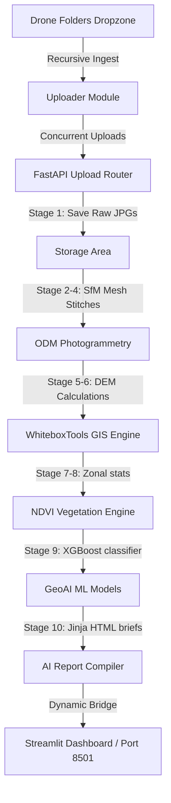

# 🌾 GeoAI Agricultural Decision-Support Platform

[](https://share.streamlit.io/)
[](https://fastapi.tiangolo.com)
[](https://www.python.org/)
[](https://opensource.org/licenses/MIT)

An automated, enterprise-grade cloud-and-offline hybrid drone photogrammetry mapping, GIS hydrology analysis, and machine learning crop diagnostics platform. Serves a premium, futuristic glassmorphic user interface concurrently via **Streamlit** (port 8501) and **FastAPI/Uvicorn** (port 8000).

---

> [!IMPORTANT]
> This platform runs in **Dual Mode**:
> 1. **Live API Mode**: Connects to the local FastAPI backend (port 8000) to execute server-side photogrammetry and WhiteboxTools hydrology analysis.
> 2. **Offline Sandbox Mode**: Runs entirely client-side inside the browser using procedural layout algorithms. Ideal for public Streamlit Cloud deployment or demoing without server dependencies.

---

## 🎨 System Architecture Overview



---

## 🚀 Key Platform Features

### 📡 High-Speed Folder Ingest
* **Recursive Scanning**: Drag-and-drop raw parent folders (supports massive `20–25 GB` datasets) without selecting individual files.
* **Auto-Batch Listing**: Automatically loops through filesystem directories to parse all `10,000+` images recursively, bypassing browser-specific listing limits.
* **Parallel Worker Streams**: Concurrency slider allows `4 to 32` concurrent upload streams to maximize disk I/O write operations.
* **Performance Telemetry**: Displays real-time upload speed (MB/s), active connections, uploaded volumes, and dynamic ETA counters.

### 🗺️ GIS & ML Spatial Canvas Viewer
An interactive HTML5 `<canvas>` engine with complete zoom, pan, and coordinate tracking:
* **Flight Trajectory Overlay**: Plots coordinates of the drone path and checks images for exposure and blur (green circles for passed, red for QC warnings).
* **High-Fidelity Orthomosaic**: Visualizes stitched crop rows, bare patches, and soil routes.
* **DEM Elevation Grids**: Renders elevation indexes with dynamically calculated topography contours.
* **Hydrological TWI Map**: Illustrates D8 flow channels, rivers, and water accumulation networks.
* **NDVI Vegetation Index**: Computes and maps crop chlorophyll density levels.
* **XGBoost Risk Matrix**: Color-codes and flags **Waterlogging** (Blue), **Erosion** (Red), and **Dry Patches** (Yellow) hazards.

---

## 📁 Repository Directory Structure

```text
GEOAI/
├── app.py                     # Streamlit Wrapper (embeds and bundles frontend)
├── index.html                 # Core glassmorphic HTML user interface layout
├── css/
│   └── styles.css             # Premium glassmorphic styling (glows, blur filters)
├── js/                        # Client-side JavaScript modules
│   ├── app.js                 # App coordinator, state, and FastAPI fetches
│   ├── renderer.js            # HTML5 Canvas Spatial GIS drawer
│   ├── uploader.js            # Concurrent directory tree parser
│   └── reporter.js            # Jinja-style HTML report generator
└── backend/
    └── app/                   # FastAPI Python 3.13 backend
        ├── main.py            # App router setup & static folder mounting
        ├── config.py          # Central directory settings
        ├── routers/           # API endpoints (upload, pipeline, models)
        │   ├── upload.py      # Folder structures replication saver
        │   ├── pipeline.py    # 10-stage processing coordinator
        │   └── models.py      # Predictor queries endpoints
        ├── services/          # Core processing engines
        │   ├── quality_control.py   # Blur/exposure validation
        │   ├── photogrammetry.py    # ODM stitching routines
        │   ├── gis_engine.py        # WhiteboxTools terrain indexes
        │   ├── vegetation.py        # NDVI/VARI calculations
        │   └── zonal_stats.py       # Metrics aggregator
        └── ml/
            └── ml_models.py   # XGBoost multi-risk classifier
```

---

## 🛠️ Local Installation & Run Guide

### 1. Initialize Your Local Environment
The project expects a Python 3.13 environment. Since the environment is located in your Downloads folder, activate it and install dependencies:
```bash
# Move into the project directory
cd /Users/sukshas/Downloads/GEOAI

# Activate the virtual environment from Downloads
source ../venv/bin/activate

# Install all backend and frontend Streamlit dependencies
pip install -r backend/requirements.txt
```

### 2. Start the FastAPI Backend Server (Port 8000)
The backend manages data ingestion, coordinate merges, and executes the WhiteboxTools and XGBoost ML routers:
```bash
uvicorn backend.app.main:app --host 0.0.0.0 --port 8000
```
* **Interactive API Docs**: [http://localhost:8000/docs](http://localhost:8000/docs) (Swagger UI)

### 3. Launch the Streamlit Frontend Site (Port 8501)
Open a new terminal window, activate the virtual environment, and start Streamlit:
```bash
# Activate the environment
source ../venv/bin/activate

# Launch the website
streamlit run app.py
```
* **Dashboard URL**: [http://localhost:8501](http://localhost:8501)

---

## ☁️ Deployment Configurations

This repository is optimized for deployment on **Streamlit Community Cloud**:

> [!TIP]
> **Pushing to Git**:
> 1. Ensure `venv/`, `backend/storage/` (uploads cache), and `__pycache__/` are added to `.gitignore` to prevent bloating the repo with gigabytes of binary data.
> 2. Force push the clean branch to your remote GitHub:
>    ```bash
>    git add .
>    git commit -m "Initial Deploy Commit"
>    git push -f origin main
>    ```

> [!NOTE]
> When hosted publicly, the Streamlit app automatically runs in **Offline Sandbox Mode**, allowing users to experience the full interactive 10-stage photogrammetry flight path and ML grid risk simulation right in their browser without requiring a backend GPU server.